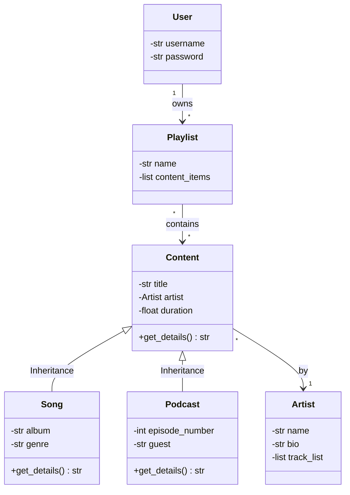
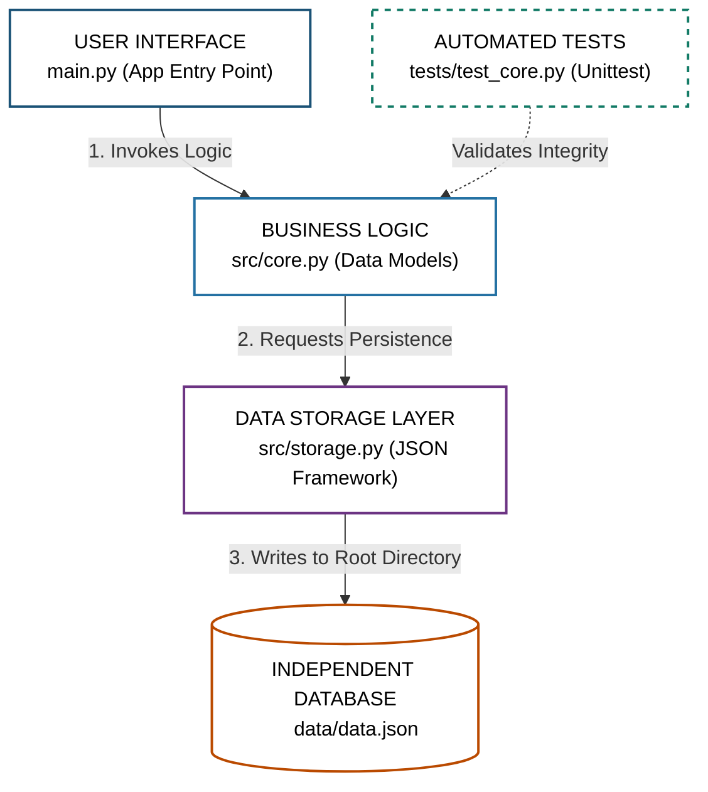

# Melodix: My Personal Music Vault 

---

### Welcome to Melodix!
 it's a digital home for my favorite tracks and cozy podcasts. I wanted to build something that feels as organized and pretty as a well-curated playlist.

### Key Features (System Architecture)
* **`Content` (Base Class):** The foundation for all tracks, supporting **Polymorphism**.
* **`Song` & `Podcast`:** Specialized classes inheriting from Content (**Inheritance**).
* **`Artist`:** Manages creators and their work (**Association**).
* **`Playlist`:** A collection of tracks that can be calculated and managed (**Aggregation**).
* **`User`:** Each user uniquely owns their personal playlists (**Composition**).
* **`MusicManager`:** The brain of the system, handling search and logic.

## Development Roadmap
| Week | Focus Area |
| :--- | :--- |
| **Week 1** | **Architecture:** Implementing base classes and complex relationships. |
| **Week 2** | **User Logic:** Building the User and Playlist interaction system. |
| **Week 3** | **Persistence:** Integrating JSON file handling for data storage. |
| **Week 4** | **Final Polish:** Decorators for logging and Search functionality. |

---

### Project Structure

```text
MusicManagementSystem/
│
├── src/
│   ├── __init__.py
│   ├── core.py
│   └── storage.py
├── tests/
│   ├── __init__.py
│   └── test_core.py
│
├── main.py
├── README.md
└── requirements.txt
---
```


### Entity Relationship Diagram



### Architecture Diagram



### Flowchart
```mermaid
graph TD
    %% High-contrast and simple styles (Black text on white background)
    classDef startStyle fill:#FFFFFF,stroke:#000000,stroke-width:2px,color:#000000;
    classDef processStyle fill:#FFFFFF,stroke:#1A5276,stroke-width:1px,color:#000000;
    classDef conditionStyle fill:#FFFFFF,stroke:#B7950B,stroke-width:2px,color:#000000;

    %% Application flow block definitions
    START([START]):::startStyle
    
    Load["Load System Data
    (StorageManager.load_data)"]:::processStyle
    
    Check{"Is User
    Logged In?"}:::conditionStyle
    
    MenuGuest["SHOW GUEST MENU
    - Register
    - Login
    - Exit"]:::processStyle
    
    MenuUser["SHOW USER DASHBOARD
    - Search Content
    - Create Playlist
    - Stream Playlists
    - Logout"]:::processStyle

    %% Logical paths and routing execution
    START --> Load
    Load --> Check
    
    Check -->|NO| MenuGuest
    Check -->|YES| MenuUser
    
    %% Infinite loop mechanics (return to session state check)
    MenuGuest -.->|Loop| Check
    MenuUser -.->|Loop| Check