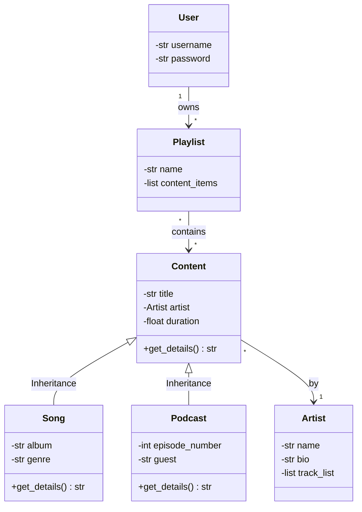

# Melodix: My Personal Music Vault 

---

### Welcome to Melodix!
 it's a digital home for my favorite tracks and cozy podcasts. I wanted to build something that feels as organized and pretty as a well-curated playlist.

### Key Features (System Architecture)
* **`Content` (Base Class):** The foundation for all tracks, supporting **Polymorphism**.
* **`Song` & `Podcast`:** Specialized classes inheriting from Content (**Inheritance**).
* **`Artist`:** Manages creators and their work (**Association**).
* **`Playlist`:** A collection of tracks that can be calculated and managed (**Aggregation**).
* **`User`:** Each user uniquely owns their personal playlists (**Composition**).
* **`MusicManager`:** The brain of the system, handling search and logic.

## Development Roadmap
| Week | Focus Area |
| :--- | :--- |
| **Week 1** | **Architecture:** Implementing base classes and complex relationships. |
| **Week 2** | **User Logic:** Building the User and Playlist interaction system. |
| **Week 3** | **Persistence:** Integrating JSON file handling for data storage. |
| **Week 4** | **Final Polish:** Decorators for logging and Search functionality. |

---

### Project Structure

```text
MusicManagementSystem/
│
├── data/
│   └── data.json
│
├── src/
│   ├── __init__.py
│   ├── core.py
│   └── storage.py
│
├── tests/
│   ├── __init__.py
│   └── test_core.py
│
├── main.py
├── .gitignore
└── README.md

---
```


### Entity Relationship Diagram



### Architecture Diagram
```mermaid
graph LR
    %% Professional Layer Color Palettes
    classDef uiStyle fill:#EBF5FB,stroke:#2980B9,stroke-width:2px;
    classDef logicStyle fill:#EAF2F8,stroke:#2471A3,stroke-width:2px;
    classDef storageStyle fill:#F4ECF7,stroke:#7D3C98,stroke-width:2px;
    classDef testStyle fill:#E8F8F5,stroke:#117A65,stroke-width:2px,stroke-dasharray: 5 5;
    classDef dbStyle fill:#FEF9E7,stroke:#D35400,stroke-width:2px;

    %% Architectural Nodes with Safe Line Breaks
    UI["USER INTERFACE
    main.py (Console Menu)"]:::uiStyle

    Logic["BUSINESS LOGIC
    src/core.py (Data Models)"]:::logicStyle

    Storage["DATA STORAGE
    src/storage.py (JSON Layer)"]:::storageStyle

    Tests["AUTOMATED TESTS
    tests/test_core.py"]:::testStyle

    JSON[("LOCAL DATABASE
    data/data.json")]:::dbStyle

    %% Explicit Data Flow and Interaction Paths
    UI -->|Calls methods| Logic
    Logic -->|Saves & Loads data| Storage
    Storage -->|Reads & Writes| JSON
    Tests -.->|Validates behavior| Logic